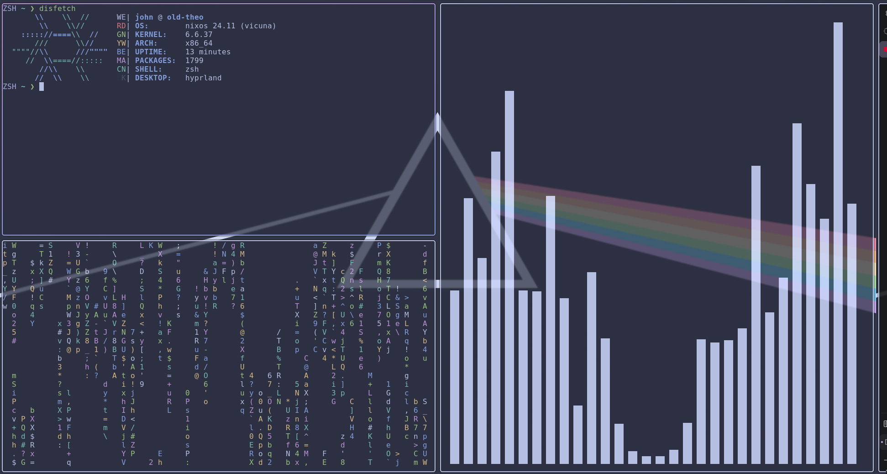

<h1 align="center">
<a href='#'></a>
  <br>
  <div>
    <a href="https://github.com/johnstclair/nixos-config/issues">
        
    </a>
    <a href="https://github.com/johnstclair/nixos-config/stargazers">
        
    </a>
    <a href="https://github.com/johnstclair/nixos-config">
        
    </a>
    <a href="https://github.com/johnstclair/nixos-config/blob/master/LICENSE">
        
    </a>
    <br>
    </div>
        
   </h1>

<div align="center">
<h1>
NixOS Config Files
</h1>
</div>

These files are nothing too special and for the most part very simple, but have a couple cool features.
Feel free to look and copy what I have setup.

## Preview


<details>
<summary>Other Screenshots</summary>
<br>
<div align="center">
  



</div>
  
</details>

## Contents

```
.
├── profiles     # configurations seperated into profiles
├── core         # system module files
├── home         # home module files
├── themes       # storage for theme files
├── docs         # image storage for the repo
```

## Components

*note, the following table lists features for the hyprland setup, but you can easily switch to use i3/kde*
| Component                   | Description                                     |
| --------------------------- | :---------------------------------------------  |
| **Window Manager**          | hyprland                                        |
| **Terminal Emulator**       | ghostty/alacritty/kitty                         |
| **Browser**                 | firefox/qt                                      |
| **Bar**                     | waybar                                          |
| **Application Launcher**    | sway-application-launcher                       |
| **Notification Daemon**     | swaync                                          |
| **Display Manager**         | sddm                                            |
| **Theme**                   | easy to change                                  |
| **Shell**                   | zsh + starship                                  |
| **Sytem Resource Manager**  | htop                                            |
| **File Manager**            | yazi                                            |
| **Text Editor**             | neovim                                          |
| **Screenshot Software**     | grimblast                                       |

## Features

- **Abstracted Settings File**: Use and sync the same config across multiple computers, while keeping settings like graphics drivers and themes unique
- **Nix Flakes**: Extremely easy to reproduce on your machine
- **Full IDE Neovim Config**: Presetup neovim, ready for developing
- **Hyprland Rice**: Setup with a visually pleasing, highly customizable, and functional window manager
  
## Installation

1. Add the following programs to your basic graphical install nix config, and rebuild
```
git gh
nh
vim (or your favorite text editor)
zsh
```

2. Clone this repo into your home directory, rename it ".nixos-config"

3. Setup the settings, to do this:
    1. Copy the file `nixos-config-settings-template.nix` and rename it to `nixos-config-settings.nix`
    2. Run `git add --intent-to-add nixos-config-settings.nix` then `git update-index --assume-unchanged nixos-config-settings.nix`
        - This will allow you have different system settings between multiple computers, even if you sync everything else between those computers. By forcing git to ignore your new settings file
    3. Actually configure your settings

4. Setup your hardware configuration
    1. Copy your hardware config into your local dotfiles dir `cp /etc/nixos/hardware-configuration.nix ~/.nixos-config/hardware-configuration.nix`
    2. Tell git to track, but not add, the file, (like above) `git add --intent-to-add hardware-configuration.nix` then `git update-index --assume-unchanged hardware-configuration.nix`

5. Rebuild using `nh os switch -H system ~/.nixos-config -- --experimental-features 'nix-command flakes'`, then reboot

6. Rebuild home using `nh home switch -b backup -c user ~/.nixos-config` then reboot

7. Profit? Maybe enjoy is a better word choice here.

> [!NOTE]
> If you have issues with these installation steps, please contact me, or open an issue.

#### Extra Setup Steps

To setup [SearXNG](https://github.com/searxng/searxng), a metasearch engine, you need to:

1. Create the file `~/.searxng.env`
2. Make the contents of the file be:
```
SEARXNG_SECRET=ultrasecretkey
```
3. Run `sudo -H sed -i -e "s/ultrasecretkey/$(openssl rand -hex 16)/g" \ "~/.searxng.env"`

### Important Commands

`update-system`: Alias for `nh os switch -H system ~/.nixos-config`, updates and switches the system. Requires sudo 

`update-home`: Alias for `nh home switch -b backup -c user ~/.nixos-config`, updates the home-manager config

`update-boot`: Alias for `nh os boot -H system ~/.nixos-config`, updates the system but does not activate the update. Requires sudo

`update-theme`: Calls update home, but adds in extra commands to restart the wallpaper service, reload programs css, etc.

## Resources

NixOS is a complex ecosystem to get started in, thanks to [Vimjoyer](https://www.youtube.com/@vimjoyer) and [LibrePhoenix](https://www.youtube.com/@librephoenix) I was able to learn the basics of nix, make sure to drop them both a sub!

I only used the Vim for VSCode extension before my NixOS experince, but I wanted to try out Neovim.  I decided to use Nixvim, the config I have is a slighty alter version of [redyf's dots](https://github.com/redyf/nixdots).

I also used Frost-Phoenix's [SwayNC dotfiles](https://github.com/Frost-Phoenix/nixos-config/tree/main/modules/home/swaync) as a base for mine.

Lastly, I based the way I organized my config, with profiles and abstracted settings, on LibrePhoenix's [nixos-config](https://github.com/librephoenix/nixos-config).
